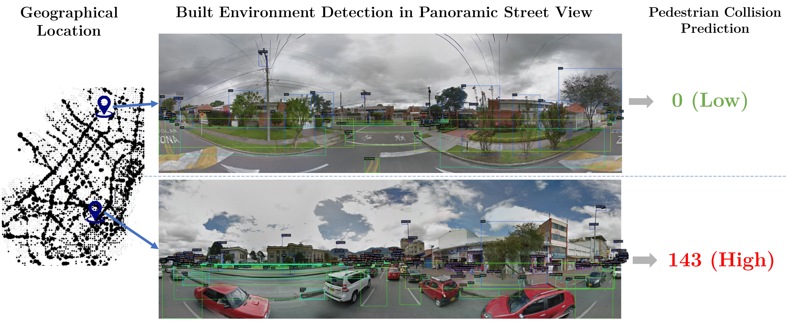
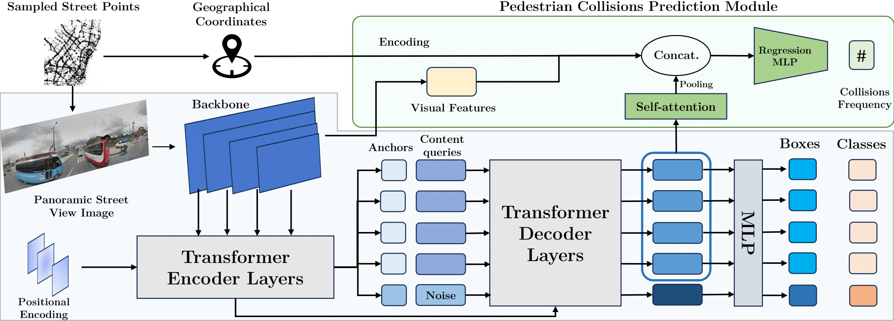

# STRIDE: Street View-based Environmental Feature Detection and Pedestrian Collision Prediction

ICCVW 2023

[Cristina Gonzalez](https://cigonzalez.github.io/)<sup>\*</sup> [Nicolás Ayobi](https://nayobi.github.io/)<sup>\*</sup>, Felipe Escallon, Laura Baldovino-Chiquillo, Maria Wilches-Mogollón, Donny Pasos, Nicole Ramírez, Jose Pinzón, Olga L Sarmiento, D. Alex Quistberg, [Pablo Arbeláez](https://scholar.google.com.co/citations?user=k0nZO90AAAAJ&hl=en) <br/>
<br/>
<font size="1"><sup>*</sup>Co-Main Authors, Equal contribution.</font><br/>

- **Best Student Paper** Award at the **ROAD++ Workshop of Situation Awareness in Autonomous Driving**. <br>Hosted at the **International Conference in Computer Vision (ICCV) 2023**. **Proceedings** available at [**IEEE Xplore**](https://ieeexplore.ieee.org/document/10350902)<br/>
- **Preprint** available at [**arXiv**](https://arxiv.org/abs/2401.11174)<br/>


<div align="center">
  
</div><br/>

This paper introduces a novel benchmark to study the impact and relationship of built environment elements on pedestrian collision prediction, intending to enhance environmental awareness in autonomous driving systems to prevent pedestrian injuries actively. We introduce a built environment detection task in large-scale panoramic images and a detection-based pedestrian collision frequency prediction task. We propose a baseline method that incorporates a collision prediction module into a state-of-the-art detection model to tackle both tasks simultaneously. Our experiments demonstrate a significant correlation between object detection of built environment elements and pedestrian collision frequency prediction. Our results are a stepping stone towards understanding the interdependencies between built environment conditions and pedestrian safety.

This repository provides instructions to download the [**STRIDE** dataset]() and run the PyTorch implementation of the [**STRIDE** baseline](), both presented in the paper *STRIDE: Street View-based Environmental Feature Detection and Pedestrian Collision Prediction*.

## STRIDE Dataset

Please download our Environmental Feature Detection and Pedestrian Collisions annotations from this [link](http://157.253.243.19/STRIDE/) using the following command:

```sh
$ wget -r http://157.253.243.19/STRIDE/
```
You can also download the data from this [Google Drive](https://drive.google.com/drive/folders/1IbnczOSC365H79Q6XU62jo-4t4fDNjKy?usp=sharing). There, you will find the bounding box annotations in COCO JSON format, a CSV with the number of pedestrian collisions associated with each image, and the list of panorama IDs of our selected images. The panoramic images must be downloaded directly from the Google Street View service using the provided list of Panorama IDs. We will soon upload an example code to download the images; in the meanwhile, please use the [Google Street View app](https://svd360.istreetview.com/) or use this [Google Street View GitHub repository](https://github.com/robolyst/streetview). Please remember that we modified the original Google Street View panoramic images by removing 1328 pixels from the top and the bottom (center crop of height 4000) to remove artifacts from panoramic image formation.

## STRIDE Baseline 

<div align="center">
  
</div><br/>

Our code is mainly based on the original [DINO](https://github.com/IDEA-Research/DINO) repo. Please check their code and paper for any further details.

### Installation
Please follow these steps to install the required dependencies to run our STRIDE baseline:

```sh
$ conda create --name stride python=3.7.3 -y
$ conda activate stride
$ conda install pytorch==1.9.0 torchvision==0.10.0 cudatoolkit=11.1 -c pytorch -c nvidia

$ git clone https://github.com/BCV-Uniandes/STRIDE
$ cd STRIDE
$ pip install -r requirements.txt

$ cd models/dino/ops
$ python setup.py build install
$ python test.py
$ cd ../../..
```

## Data Preparation

Please download all panoramic images with the provided list of Panorama IDs and the data, as explained previously. Please locate the images in a directory named ```images``` and the files in a directory named ```annotations``` and indicate the path to this directory with the ```coco_path``` argument. 

Then, please download our pretrained models from the data [link](http://157.253.243.19/STRIDE/), and indicate the path to the model with the ```pretrain_model_path``` argument.

## Run the code

We have provided default bash scripts with the parameters to run our code. Please use these scripts to train and evaluate our model as follows:

```sh
# Train for built environment feature detection
$ sh scripts/STRIDE_train_detection_dist.sh

# Train for pedestrian collision prediction
$ sh scripts/STRIDE_train_regression_dist.sh

# Test both tasks
$ sh scripts/STRIDE_eval_dist.sh
```

## Contact

Feel free to contact n.ayobi@uniandes.edu.co for any questions or information.

## Citing STRIDE

```BibTeX
@InProceedings{gonzalez-ayobi2023stride,
    author={González, Cristina and Ayobi, Nicolás and Escallón, Felipe and Baldovino-Chiquillo, Laura and Wilches-Mogollón, Maria and Pasos, Donny and Ramírez, Nicole and Pinzón, Jose and Sarmiento, Olga and Quistberg, D. Alex and Arbeláez, Pablo},
    booktitle={2023 IEEE/CVF International Conference on Computer Vision Workshops (ICCVW)}, 
    title={STRIDE: Street View-based Environmental Feature Detection and Pedestrian Collision Prediction}, 
    year={2023},
    pages={3222-3234},
    keywords={Visualization;Pedestrians;Transportation;Benchmark testing;Predictive models;Feature extraction;Frequency estimation;Autonomous Driving;Pedestrian Safety;Collision Prediction;Situational Awareness;Panoramic Images},
    doi={10.1109/ICCVW60793.2023.00347}
}
```